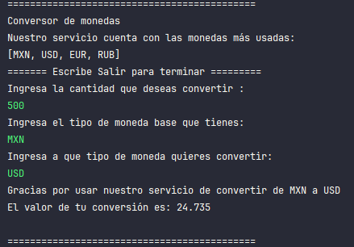

## Challenge de Alura Latam:  Conversor de monedas
_ _ _ 
### Tecnologías usadas
* **Java 17**
* **Postman**
* **Gson 2.10.1**

### API 
La API usada en este challenge fue [**ExchangeRate-API.**](https://www.exchangerate-api.com)

La **funcionalidades** del conversor son para **4 tipos de monedas**:
* USD
* MXN
* EUR
* RUB

### Ejemplo
